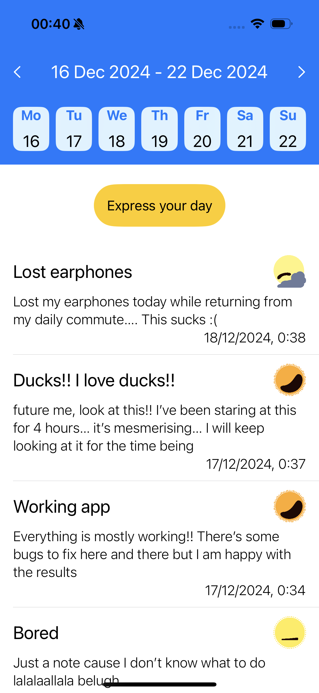
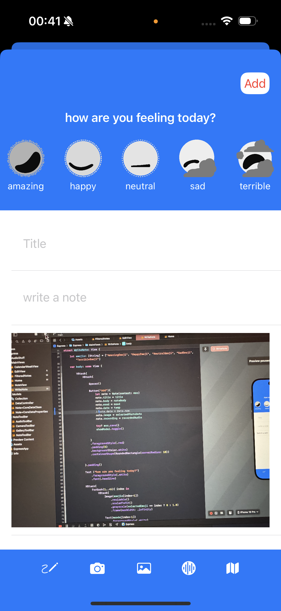
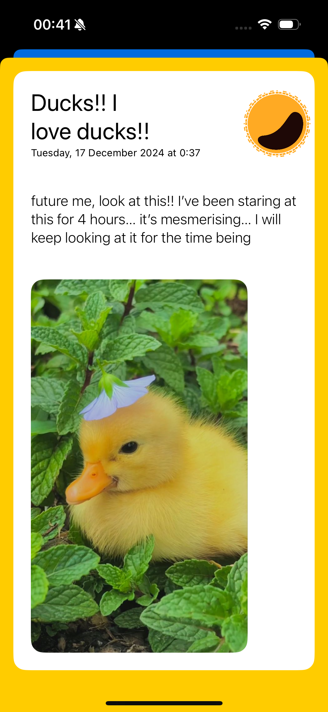

# Express

Express is a journaling app built on Xcode. Its use is to keep track of your day by day entries, focusing on personalizing each entry with photos, audio recordings and other features.

## Features

- add, delete and edit notes
- personalize notes with images and audio
- search through notes by date with the calendar
- express your current mood through an emoji system

## Installation
1. Clone this repository: `git clone <https://github.com/AlesR000/Express-Project.git`>
2. Open the project in Xcode.
3. Run the app on a simulator or connected device.

###Screens

Here are some app screenshot to better understand how it looks!

 

